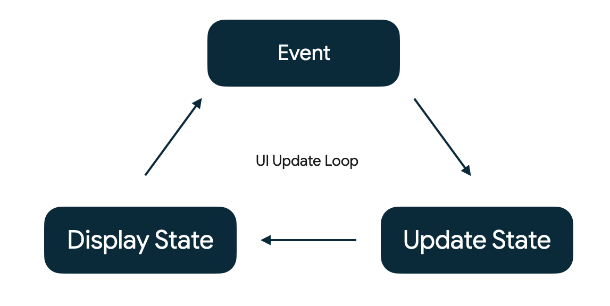
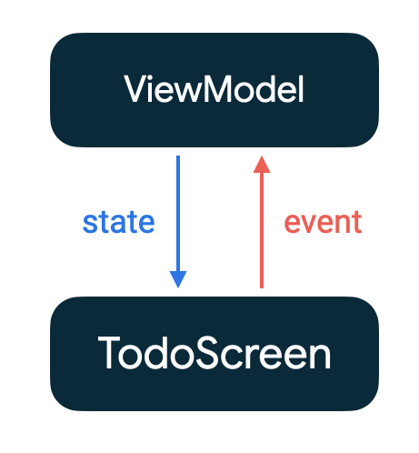
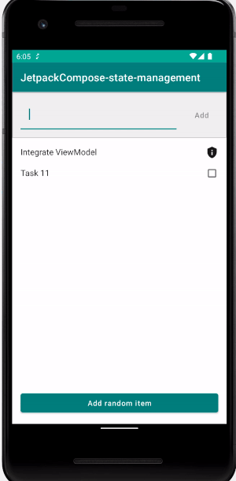

# Jetpack Compose State Management

A sample project to demonstrate State Management in Jetpack compose by following [This CodeLab](https://developer.android.com/codelabs/jetpack-compose-state).

Through the project you can get acquainted with

1. What is unidirectional data flow
2. How to think about state and events in a UI
3. How to use Architecture Component's ViewModel and LiveData in Compose to manage state
4. How Compose uses state to draw a screen
5. State hoisting
6. How to use internal state in Compose
7. How to use `State<T>` to integrate state with Compose
8. Test State in ViewModel

## Unidirectional Data Flow
In Android apps, state is updated in response to events. Events are inputs generated from outside our application, such as the user tapping on a button calling an OnClickListener, an EditText calling afterTextChanged, or an accelerometer sending a new value.

Events notify a part of a program that something has happened.

For example, a user pressing a button will call a click event.

In all Android apps, there's a core UI update loop that goes like this:

**Event** – An event is generated by the user or another part of the program

**Update State** – An event handler changes the state that is used by the UI

**Display State** – The UI is updated to display the new state

Managing state in Compose is all about understanding how state and events interact with each other.

**Unidirectional data flow** is a design where events flow up and state flows down.

For example, in a ViewModel events are passed up with method calls from the UI while state flows down using LiveData.

It's not just a term to describe ViewModel – any design where events flow up and state goes down is unidirectional.

# Implementation
